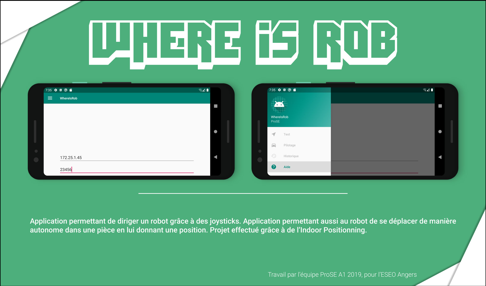

# Robot_ProSE


[](https://github.com/RemyCo/Robot_ProSE/blob/master/LICENSE)




App developed for an ESEO Android Project. Application that can move a robot with joysticks. The application can also give a destination to the robot, where it has to go by itself by the use of Indoor positioning system. We can see the robot position on the Android Application when connected to the same network.

## How to import the project ?

### In Android studio :

1. Open Android Studio

2. Click on Check out project from Version Control

3. Click on Git

4. On URL, put https://github.com/RemyCo/Robot_ProSE

### In files :

```bash
# Clone this repository
$ git clone https://github.com/RemyCo/Robot_ProSE.git
```
